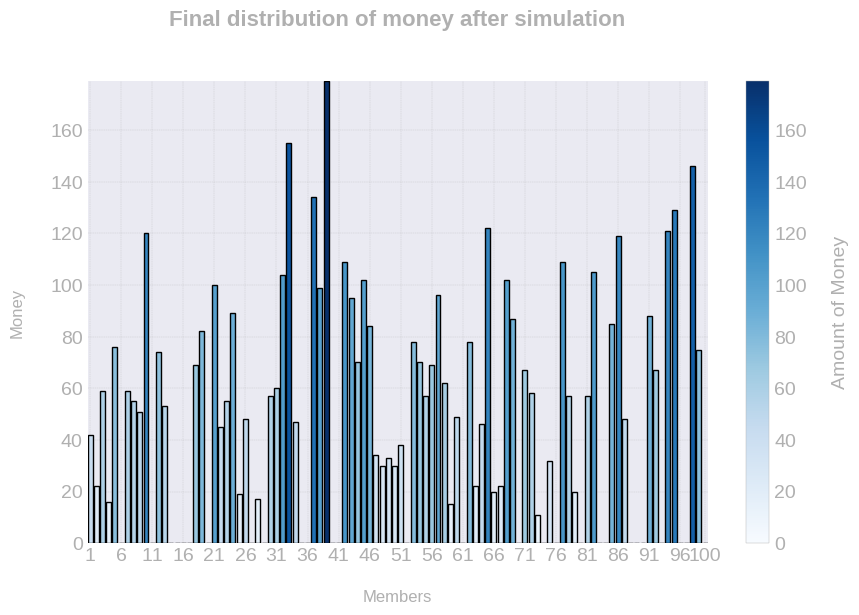
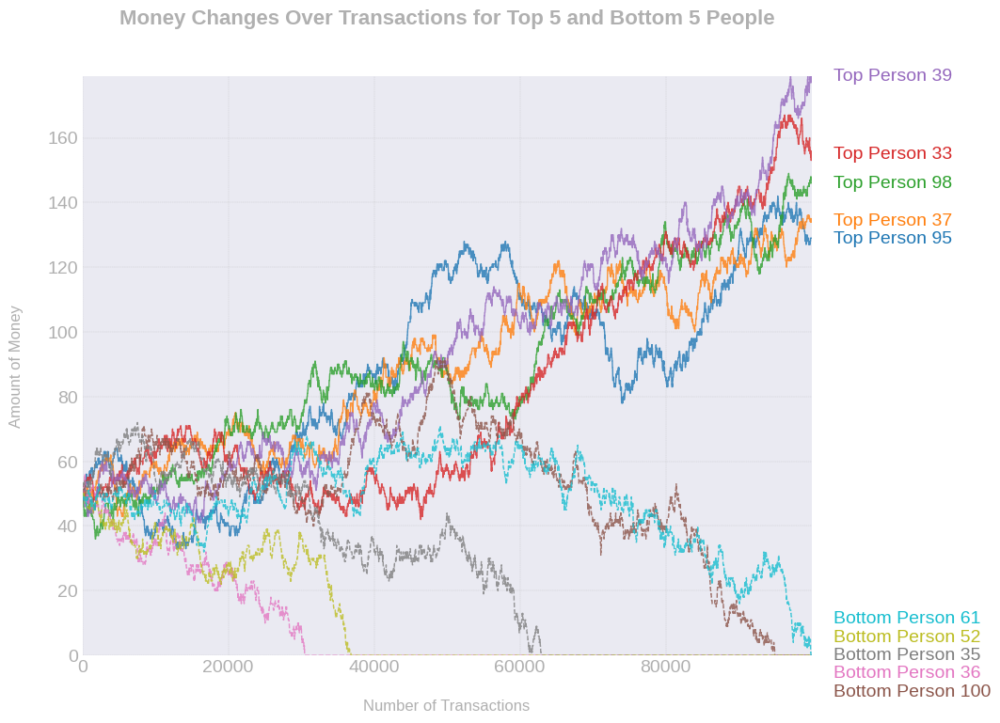
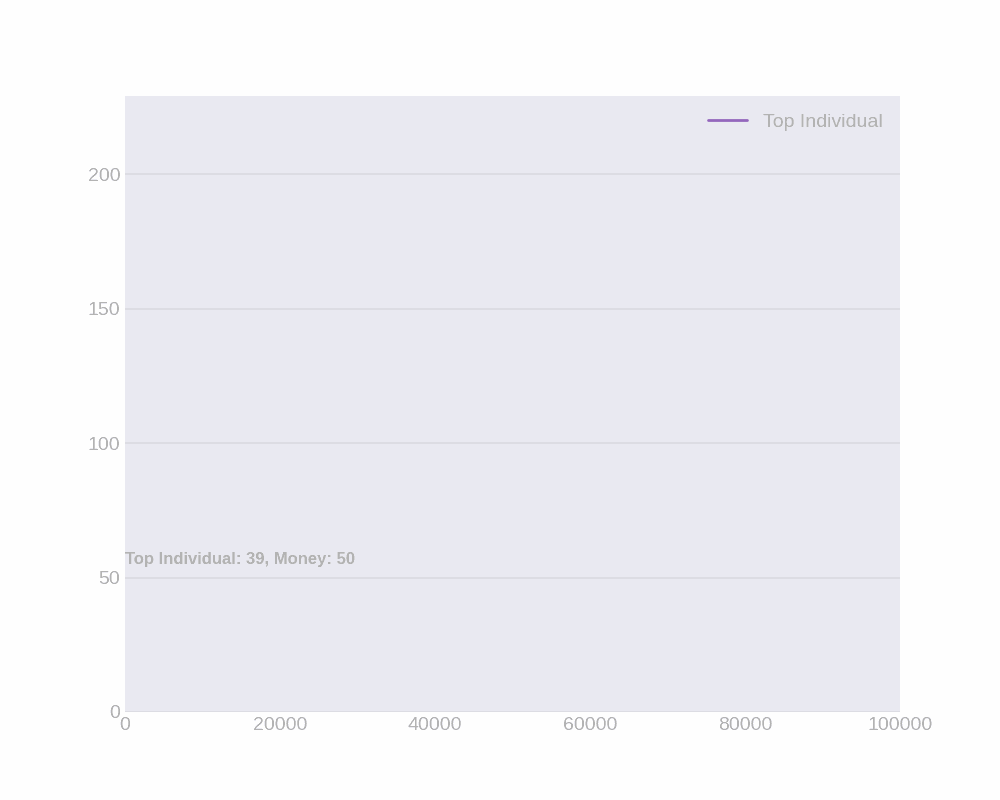

# Charts in Money Exchange Simulation

This document provides a brief description of the charts generated from the money exchange simulation project. These charts visualize the results of the simulation, showing how money is distributed among participants over time.

## 1. Final Money Distribution Bar Chart

**Description:**
The bar chart represents the final amount of money each participant holds after all transactions in the simulation.

- **X-Axis (Members):** Each participant is represented by a number on the x-axis, from 1 to 100.
- **Y-Axis (Amount of Money):** The total amount of money each participant has at the end of the simulation is indicated on the y-axis.
- **Color Intensity:** A color gradient is used to represent the amount of money; darker colors indicate higher amounts. This chart effectively illustrates the uneven distribution of wealth among participants, reflecting the randomness inherent in the simulation.

---
## 2. Money Changes Over Transactions for Top 5 and Bottom 5 People

**Description:**
This line chart visualizes the changes in the amount of money over time for the top 5 richest and bottom 5 poorest participants during the course of the simulation.

- **X-Axis (Number of Transactions):** The x-axis represents the total number of transactions that occurred in the simulation.
- **Y-Axis (Amount of Money):** The y-axis indicates the amount of money each participant had at various points during the simulation.
- **Top 5 Participants (in different colors on the right side):** The participants with the most money are represented in the top portion of the chart. These individuals experienced consistent growth or fluctuations in wealth over the course of transactions.
- **Bottom 5 Participants (in different colors on the left side):** The participants with the least amount of money are shown at the bottom of the chart. Their financial status typically declined, reflecting their disadvantage in the random distribution of money.
- **Key Insights:**
    - Some participants were able to accumulate wealth consistently, while others struggled to maintain or grow their initial amounts.
    - The wealth distribution shows a dynamic interaction where the fortunes of individuals can change significantly over time, but the general trends for the top and bottom participants are clear.

---

## 3. Animated Visualization of the Top Participant's Financial Progress

**Description:**
This animation shows how the distribution of money among participants changes over the course of the simulation.

- **X-Axis (Time):** The simulation progresses over time as participants randomly exchange money.
- **Y-Axis (Money):** The y-axis tracks the amount of money each participant has during different stages of the simulation.
- **Observation:** Over time, we can see fluctuations in the money distribution among the participants, illustrating the random nature of the exchanges.

---

## Saving and Accessing the Charts
All charts are saved in the `charts` directory. The images can be accessed using the following paths:

- **Final Money Distribution Bar Chart:** `charts/final-money-distribution.png`
- **Money Changes Over Transactions for Top 5 and Bottom 5 People:** `charts/top-and-bottom-five-financial-status.png`
- **Animated Visualization of the Top Participant's Financial Progress:** `charts/money_change_animation.gif`